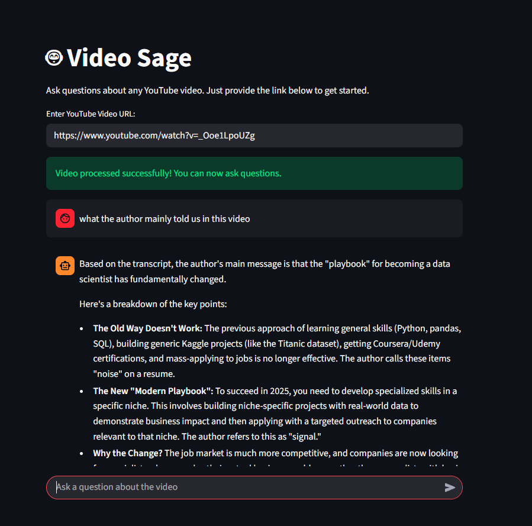

# Video Sage — YouTube Video Based RAG

Video Sage is a small Retrieval-Augmented Generation (RAG) project that turns a YouTube video's transcript into a searchable knowledge source and answers user questions about the video using a generative LLM. The project uses LangChain-style components, a local FAISS vector store for embeddings, and a Streamlit UI to interactively ask questions about a processed video.

---

## Key features
- Load YouTube transcript automatically (no extra YouTube API key required).
- Split transcript into chunks and embed with SentenceTransformers.
- Store embeddings in a FAISS index and retrieve relevant chunks.
- Use Google Generative AI (via langchain_google_genai) as the LLM to produce answers based only on retrieved transcript passages.
- Streamlit frontend for an interactive chat experience.

---

## Tech stack & libraries used
- Python 3.10–3.12 (recommended)
- Streamlit — UI
- youtube-transcript-api — transcript loader
- sentence-transformers / HuggingFaceEmbeddings — embedding model
- faiss-cpu — vector store (local)
- langchain / langchain-core / langchain-community — RAG plumbing and helpers
- langchain_google_genai — Google Generative AI LLM wrapper (ChatGoogleGenerativeAI)
- dotenv — load .env credentials
- Pillow — image/PIL dependency if used by other libs

See `requirements.txt` for the exact dependency list used in this project.

---

## Quick start (Windows)

1. Clone or copy this project folder:
   - Place project at e:\ML Projects\Projects\Youtube Video Based RAG (or any path you choose).

2. Create and activate a virtual environment (Windows PowerShell):
   ```powershell
   python -m venv .venv
   .\.venv\Scripts\Activate.ps1   # PowerShell
   # or for cmd:
   .\.venv\Scripts\activate.bat
   ```

3. Install dependencies:
   ```powershell
   pip install -r requirements.txt
   ```
   Notes:
   - If pip fails on `faiss-cpu==1.7.4`, use a supported version such as `faiss-cpu==1.8.0` or `faiss-cpu>=1.8.0`. Adjust `requirements.txt` accordingly.
   - If you see `ModuleNotFoundError: No module named 'PIL'`, install Pillow:
     ```powershell
     pip install Pillow
     ```

4. Create a `.env` file in the project root with your API keys (example):
   ```
   # .env (example)
   GOOGLE_API_KEY=your_google_api_key_here
   # or set GOOGLE_APPLICATION_CREDENTIALS to a service account JSON if required by your Google setup
   OPENAI_API_KEY=your_openai_api_key_if_using_openai
   ```
   - This project uses `langchain_google_genai.ChatGoogleGenerativeAI`. Please consult that package's docs for exact environment variables / auth method required (API key or service account JSON).

5. Prevent committing secrets:
   - The project already includes `.gitignore` entries:
     ```
     .env
     .env.local
     .env.*
     ```
   - If you previously committed `.env`, stop tracking it:
     ```bash
     git rm --cached .env
     git add .gitignore
     git commit -m "Ignore .env"
     git push
     ```

---

## Run the Streamlit app (recommended)
Start the interactive UI:
```powershell
streamlit run app.py
```
- Paste a YouTube video URL into the input box.
- Wait while the transcript is processed and indexed (first run may take time).
- Ask questions in the chat box; the assistant will answer based only on the transcript or state it cannot find the answer.

---

## Run the CLI (optional)
There is a `main.py` used for CLI/testing. Run:
```powershell
python main.py
```
Follow prompts to enter a YouTube URL and ask questions.

---

## Important implementation notes & troubleshooting

- YouTube transcript fetching:
  - This project uses `youtube-transcript-api` loader (via `YoutubeLoader` wrapper). Recent versions use `list_transcripts(...).find_transcript([...]).fetch()` internally — ensure your code uses the current API. If you see: `AttributeError: YouTubeTranscriptApi has no attribute 'get_transcript'`, update usage to the newer methods.

- FAISS installation issues:
  - pip often shows only certain wheel versions for your Python version and platform. If `faiss-cpu==1.7.4` is unavailable, choose a published version from PyPI (e.g., `1.8.0`, `1.9.0` etc.) that matches your Python/OS. Example: `pip install faiss-cpu==1.8.0`.

- LangChain dependency conflicts:
  - If pip reports resolution conflicts between `langchain-core`, `langchain-community`, or `langchain`, relax exact pins (use `>=` or align versions). Use the versions listed in `requirements.txt` as a starting point.

- VS Code "red imports":
  - If VS Code flags imports as missing, ensure:
    1. The virtual environment is selected as the Python interpreter (Ctrl+Shift+P → Python: Select Interpreter).
    2. Packages are installed into that environment.
    3. Reload the window if needed.

- Common errors:
  - ModuleNotFoundError: PIL → install `Pillow`.
  - AttributeError from `youtube_transcript_api` → switch to `list_transcripts().find_transcript().fetch()`.
  - `ResolutionImpossible` during pip install → adjust version pins, remove conflicting exact versions, or create a fresh venv before installing.

---

## Project structure (high level)
- app.py — Streamlit frontend and main RAG logic
- main.py — CLI variant / developer testing script
- requirements.txt — Python dependencies
- .gitignore — ignores .env and common files
- README.md — this file

---

## Security & privacy
- Never commit `.env` or any secret keys to source control. Use `.gitignore` and `git rm --cached` for already committed secrets.
- If you must remove a secret from history, use a history-rewriting tool such as the BFG Repo-Cleaner — be careful; this requires force pushing and coordination with collaborators.

---

## Extending & customization
- Replace LLM: swap `ChatGoogleGenerativeAI` for an OpenAI or other provider (adjust .env variables and import).
- Change embeddings: use different HuggingFace models or embedding providers for better results.
- Persist FAISS index: currently the code uses a temporary directory during creation; modify to save a persistent index path to avoid re-indexing every run.

---

## Contributing
- Fork, create a branch, submit PR.
- Keep dependency changes minimal and documented.
- Add tests for new logic where applicable.

---

## License
Choose an appropriate license for your project (MIT, Apache-2.0, etc.). This repository does not include a license file by default.

---

If you want, I can:
- generate a polished LICENSE file,
- provide a ready-to-use `.env.example`,
- update `requirements.txt` with pinned compatible versions for your Python (tell me your Python version), or
- commit this README.md into your project (I can provide the exact file content to paste).

## Demo
